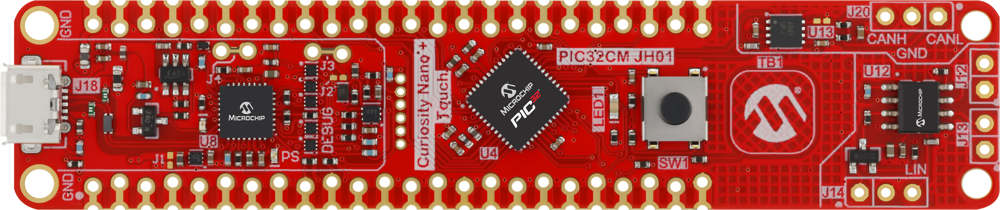
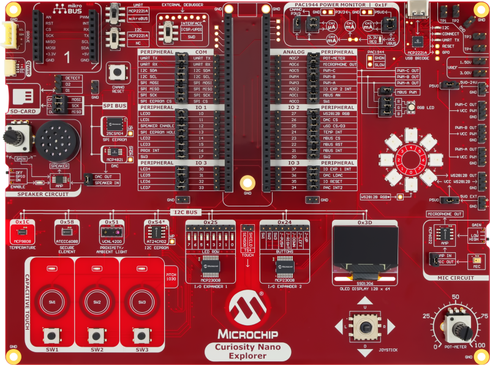
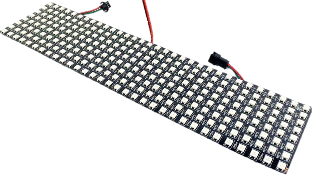
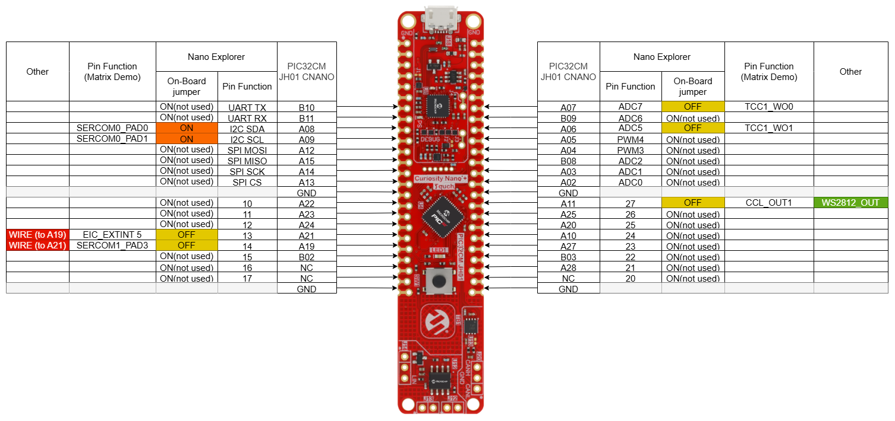
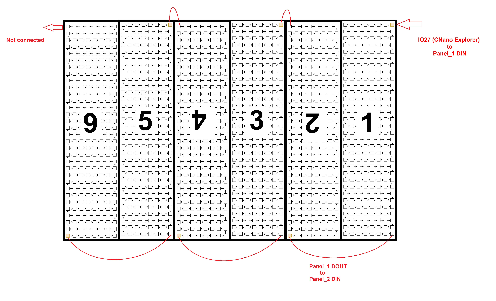
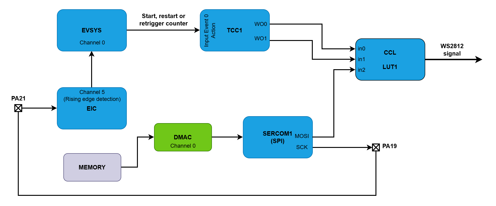
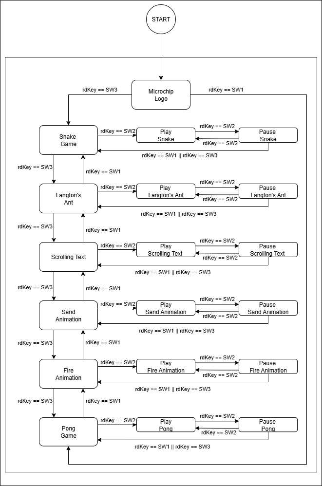
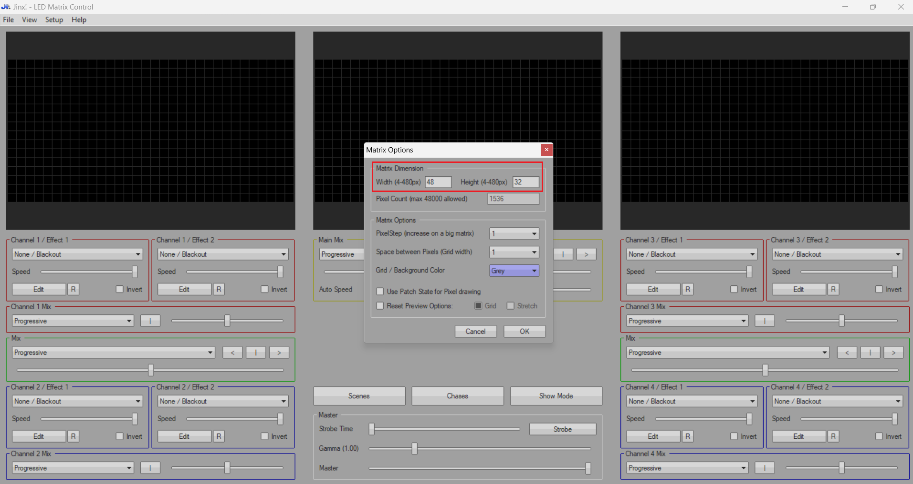
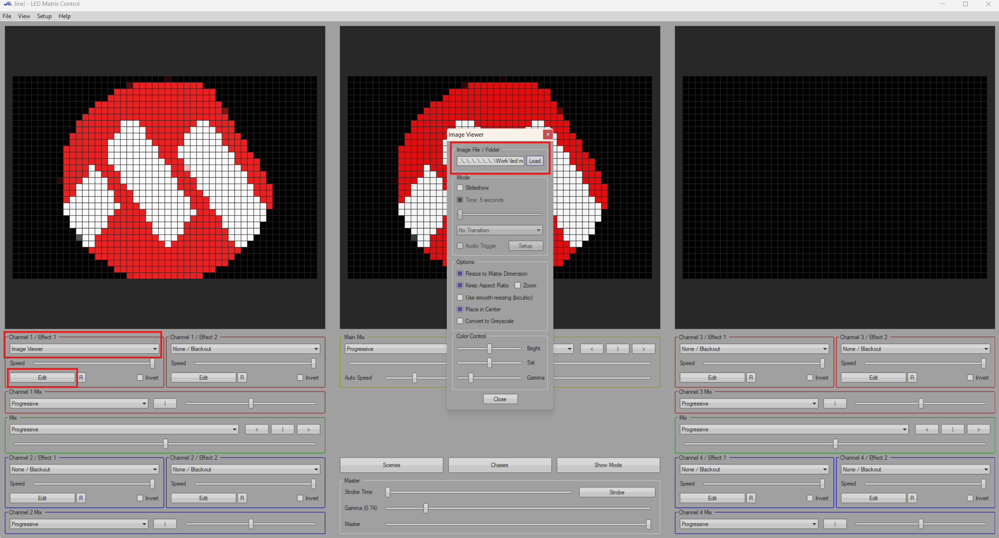
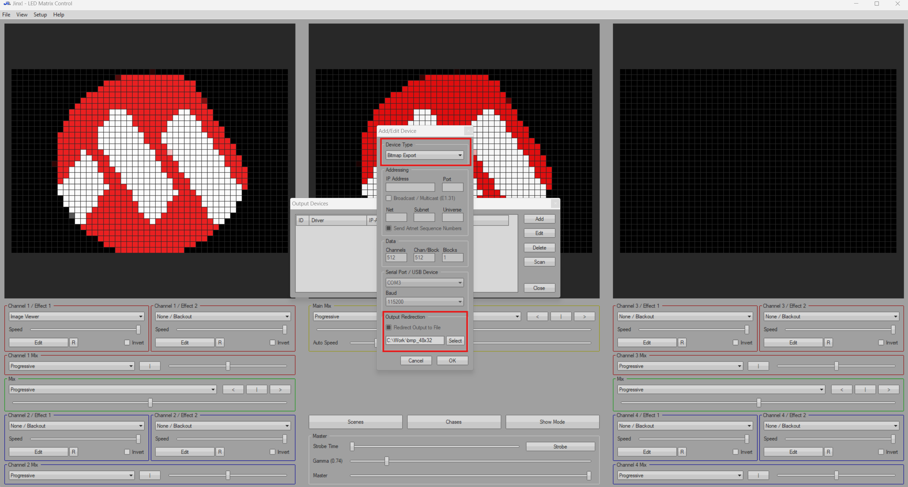

<!-- Please do not change this html logo with link -->

<a target="_blank" href="https://www.microchip.com/" id="top-of-page">
   <picture>
      <source media="(prefers-color-scheme: light)" srcset="images/mchp_logo_light.png" width="350">
      <source media="(prefers-color-scheme: dark)" srcset="images/mchp_logo_dark.png" width="350">
      
   </picture>
</a>

# Creating an Arcade: Animations and Games - Using the PIC32CM-JH01 Microcontroller With MCC Harmony
The repository provides a comprehensive collection of MPLAB® X projects specifically designed to leverage the PIC32CM-JH01's peripheral functionality to control a WS2812 LED matrix. These projects showcase various interactive applications that demonstrate the capabilities of the microcontroller in managing complex LED patterns and animations. Among the featured applications, there are several dynamic and visually engaging examples:
- [Scrolling Text](#scrolling-text): A dynamic way to present messages on an LED matrix, creating smooth transitions and a visually appealing display
- [Animations](#play-animation): Showcases engaging visual effects, including color fading, sand falling and piling, and fire animation
- [Snake Game](#snake-game): A classic arcade game where the player controls a growing line, themed as a snake, collecting items while keeping the snake away from colliding with obstacles and itself
- [Langton's Ant Demo](#langtons-ant): A simulation of Langton's Ant, a cellular automaton that produces intricate, unpredictable patterns as it moves across the LED matrix
- [Pong Game](#pong-game): A simple version of the iconic Pong game, where players can bounce a pixelated "ball" back and forth on the LED matrix
- [Static Images](#static-images): Displays static images on the LED matrix  

These projects highlight the versatility of the PIC32CM-JH01 in creative, interactive displays, making it a valuable resource for anyone interested in embedded systems and LED control.

## Related Documentation
- [PIC32CM5164JH01048 Product Page](https://www.microchip.com/en-us/products/microcontrollers/32-bit-mcus/pic32-sam/pic32cm-jh?utm_source=GitHub&utm_medium=TextLink&utm_campaign=MCU8_PIC32CM-JH01&utm_content=pic32cm5164jh01048-cnano-led-matrix-mplab-mcc-github&utm_bu=MCU08)
- [PIC32CM5164JH01048 Code Examples on Discover](https://mplab-discover.microchip.com/v2?dsl=PIC32CM5164JH01048)
- [PIC32CM5164JH01048 Code Examples on Github](https://github.com/Microchip-MPLAB-Harmony/reference_apps_pic32cm/tree/v1.0.0/apps/pic32cm_jh01_cnano)

## Software Used

- [MPLAB® X IDE v6.25](https://www.microchip.com/en-us/tools-resources/develop/mplab-x-ide?utm_source=GitHub&utm_medium=TextLink&utm_campaign=MCU8_PIC32CM-JH01&utm_content=pic32cm5164jh01048-cnano-led-matrix-mplab-mcc-github&utm_bu=MCU08) or newer
- [MPLAB® XC32 v5.00](https://www.microchip.com/en-us/tools-resources/develop/mplab-xc-compilers/xc32?utm_source=GitHub&utm_medium=TextLink&utm_campaign=MCU8_PIC32CM-JH01&utm_content=pic32cm5164jh01048-cnano-led-matrix-mplab-mcc-github&utm_bu=MCU08) or newer
- [PIC32CM-JH_DFP v1.5.236](https://packs.download.microchip.com/) or newer

## Hardware Used
- The [PIC32CM JH01 Curiosity Nano+ Touch board](https://www.microchip.com/en-us/development-tool/ev29g58a?utm_source=GitHub&utm_medium=TextLink&utm_campaign=MCU8_PIC32CM-JH01&utm_content=pic32cm5164jh01048-cnano-led-matrix-mplab-mcc-github&utm_bu=MCU08) is used as a test platform:
     
- [Curiosity Nano Explorer board](https://www.microchip.com/en-us/development-tool/EV58G97A?utm_source=GitHub&utm_medium=TextLink&utm_campaign=MCU8_PIC32CM-JH01&utm_content=pic32cm5164jh01048-cnano-led-matrix-mplab-mcc-github&utm_bu=MCU08) is used as a test platform:
     
- 6 x WS2812B LED Panels (32 x 8 LEDs)
     
- DC Power Supply 5V 40A 

## Operation
To program the Curiosity Nano board with this MPLAB X project, follow the steps provided in the [How to Program the Curiosity Nano Board](#how-to-program-the-curiosity-nano-board) chapter.  

## Setup

To complete this hardware setup, the next steps must be done:

1. Plug the **PIC32CM JH01 Curiosity Nano** board onto the **Curiosity Nano Explorer** board, but do not connect the assembled LED panel yet.
2. On the **Curiosity Nano Explorer** platform, connect pin 14 (A19) to pin 13 (A21) using a jumper wire.
3. Verify if the jumper connections are identical with the diagram below.
4. Connect the LED matrix to  pin 27 (A11), ensuring the LED panel's ground (GND) is also connected to the ground on the Curiosity Nano Explorer.
5. Power on the LED matrix, followed by the Curiosity Nano Explorer board using the USB-C® connector. The LED matrix is now displaying the Microchip logo.

The PIC32CM JH01 Curiosity Nano board pin allocation is configured specifically for use on the Curiosity Nano Explorer platform, as in the below picture:
 

The following image illustrates the interconnection of **WS2812 LED matrices** and shows how the image will appear on the display.

 

Six WS2812 LED matrix panels with a configuration of 32 x 8 are utilized and connected in chain, meaning that the output of one panel serves as the input for the next panel. The figure above shows how all of the matrix panels are chaining. Data signal is connected to the first panel on `Panel_1 DIN`, the last panel remaining not connected, `Panel_6 DIN`. To display the image, all six matrices are treated as a single 48 x 32 matrix. The orientation used for this matrix is serpentine orientation, in which the data flow follows a zig-zag pattern.

The first pixel from the resulting matrix is the pixel set in `TOP_LEFT` corner corresponding to panel number 6. For each panel, it acts as the last entry pixel. The last pixel for odd panels is in `BOTTOM_RIGHT`, while for even panels it is in `TOP_LEFT`, these panels being inverted. To display the desired image, it is necessary to find the memory offset relative to the start address where the image is stored in memory. The offset is calculated on the basis of the current position in the resulted matrix and in the actual panel. If the pannel possition type is `TOP_LEFT`, the offset is decremented and the pixels are set from bottom to top; otherwise, the offset is incremented and the pixels are set from top to bottom.

## Concept

The current demo implements the following applications:

- Displaying static images and scrolling text (Microchip Logo and Scrolling Text)
- Playing animations, Sand Animation and Fire Animation
- Running games such as Snake and Pong
- Demonstrating cellular automation with Langton's Ant

For user interaction, the on-board switches and the joystick are employed, which are read through the I2C interface. The interconnection between the microcontroller and the external components is illustrated in the image below, along with the necessary communication protocols and the output signal to the LED matrix.

 

The WS2812 protocol is implemented using the PIC23CM-JH01's internal resources, generating all the precise timing and data signals in hardware. The Timer Counter for Control Applications1 (TCC1) produces two waveform outputs, WO0 and WO1, representing the timing for the low and high periods of the WS2812. The data stored in memory for each image is transferred via the Direct Memory Access Controller (DMAC) to the Serial Communication Interface1 (SERCOM1), which outputs the data stream in Serial Peripheral Interface (SPI) format. The Configurable Custom Logic (CCL) receives the timing signals from TCC1 and the data stream from SERCOM1, combining them to generate the WS2812 signal. The positive edge of the SCK signal is used to restart the TCC1 for a correct representation of each bit. For that, the output pin for the SCK signal (PA19) is connected using an external wire to the input pin (PA21) of the External Interrupt Controller (EIC) on Channel 5. When an external event occurs on pin PA21, the EIC detects it and routes the event through the Event System (EVSYS) to TCC1.

 

**Note:** In the header file named `mainApp.h`, the user can select, through six define directives, which applications to have available upon code loading. A define with a value of ‘`1`’ includes the application in the compilation, whereas a value of ‘`0`’ excludes it.

## User Interface

Below is an introductory overview of the user interface for the Curiosity Nano Explorer. This section provides key details about the layout, functionality and available controls within the interface, helping users understand how to navigate and operate the platform effectively.

- **SW1** and **SW3** are used to navigate through existing applications in the main menu
- **SW2** is used to select and start the current application. While the application is running, **SW2** can also be used to pause or continue the current application.
- The joystick serves as the controller for games such as Snake and Pong
- To return to the main menu, **SW1** and **SW3** can be used when the current application is paused or has ended

 

### Snake Game

The Snake Game is a classic arcade game where the player controls a snake that navigates a plane, collecting food items while avoiding collisions with its tail or the walls. Each time the snake consumes food, it grows longer, increasing the game's difficulty. The objective is to survive as long as possible while the snake continues to grow, the game speed thus potentially increasing.

 

- **Note:** This gif is played at 8x speed.

This application is divided into two zones on the LED matrix. The first zone, defined by the walls, snake and food, is described by the dimensions `SNAKE_PANEL_XSIZE` and `SNAKE_PANEL_YSIZE`, which can be modified by the user. The second zone displays the `PTS` (short for _POINTS_) message and the current length of the snake, which is also used to represent the score, by subtracting three—the initial length of the snake. The maximum length of the snake can be adjusted by setting the `SNAKE_MAX_LENGTH` value. A difficulty system is included to enhance the game's challenge using the `SNAKE_SpeedSet` function, which adjusts the game speed based on the snake's length. The score is displayed using the `SNAKE_ScorePrint` function, which clears the matrix area and shows the game points via the `WS2812_Printf` function.

The `SNAKE_Initialize` function sets up the snake game, fixing the initial positions of the snake and food based on the panel size (`SNAKE_PANEL_XSIZE` and `SNAKE_PANEL_YSIZE`). The snake's first move is downward, determined by the values in the `direction` vector, which indicates the movement direction on the map. The `SNAKE_Advance` function moves the snake to the next position, checking if the move is valid by ensuring the snake's head does not collide with the walls or its own tail. If the move is valid and the snake reaches the food, the snake's length increases, a new random food position is generated, and the score is updated. If the move is not to a food position, the snake's length remains the same, and the head moves to the next position while the tail is removed.

The `SNAKE_Main` function is the primary function, called periodically from the main loop. It checks the last pressed key, with six possible actions, including game initialization, returning to the menu or changing direction. The game speed is updated by calling the `SNAKE_SpeedSet` function, and the snake advances to the next position. Additionally, this function includes two conditions to check if the game has ended: a loss if the snake collides with the walls or its own tail, or a win if the snake reaches the maximum length set by `SNAKE_MAX_LENGTH`.

**Note:** The user can modify the previously mentioned parameters by updating the values in the define section of the source file.

### Langton's Ant

Langton's Ant operates on a simple set of rules that generate complex patterns through the movement of ants. The rules dictate that an ant can move one step in any of the four cardinal directions: up, down, left or right. After each movement, the ant rotates 90 degrees to the right if the new square is black, or 90 degrees to the left if it is colored. The color of the square is updated after each step; if the current square is colored, the ant changes it to black. The entire matrix is used to display the pattern generated by the ants' movements.

 

- **Note:** This gif is played at 8x speed.

The number of ants is defined by the `N` parameter, which is based on the matrix dimensions. Upon starting the application, the `LANT_Initialize` function randomly sets the initial positions of the ants. The `LANT_Main` function is periodically invoked from the main loop to apply the game rules and move each ant accordingly. The `LANT_PixelColorCheck` function determines whether the current pixel is colored and changes it to black or vice versa. The `LANT_DirectionSet` function moves an ant to a new position based on its current direction, while the `LANT_PositionCheck` function ensures the ant remains within the matrix boundaries. Finally, the `LANT_DirectionCheck` function verifies whether the ant needs to rotate left or right for its next move, based on the aforementioned rules.

**Note:** The user can modify the previously mentioned parameters by updating the values in the define section of the source file.

### Pong Game

Pong is a straightforward game featuring two paddles and a ball, designed to simulate table tennis. The objective is to strike the ball with the paddle and score points when the opponent fails to return it. This version is a single-player game where the user can control their paddle using a joystick for upward and downward movements, while the opponent's paddle operates automatically.

 

- **Note:** This gif is played at 4x speed.

The `PONG_Main` function serves as the primary function, invoked periodically from the main loop. The `PONG_CollisionCheck_BallMove` function checks if the ball has collided with the top or bottom walls or a player's paddle and adjusts its direction accordingly. To create the movement effect, the ball is erased and redrawn in its new position using the `WS2812_PixelSet` function. Similar operations are performed to move the two paddles up and down using the `PONG_PlayerPaddleMove` and `PONG_EnemyPaddleMove` functions. When a player loses, the `PONG_RoundNew` function updates the score and reinitializes the game with the ball in a random position. The score is managed using the `WS2812_ValuePrint` operation, which deletes the old value and updates it with the new one. A new game round begins when an up or down command is executed. The `PADDLE_COUNTER` and `BALL_COUNTER` definitions are used to set the speed of the opponent's paddle and the ball.

The initial top-left position of the court can be configured using the `COURT_X` and `COURT_Y` definitions, which represent the physical (_x_, _y_) coordinates in the matrix. The court dimensions along each axis can be specified using the `COURT_LENGTH_X` and `COURT_LENGTH_Y` macros. These settings must be adjusted according to the court's starting position and the physical dimensions of the matrix. The paddle dimensions are automatically determined based on the court's height.

**Note:** The user can modify the previously mentioned parameters by updating the values in the define section of the source file.

### Scrolling Text
The scrolling text efect is a dynamic way to display messages on an LED matrix. This feature takes a user-defined message and animates it from right to left, creating smooth and continous transitions across the display. The `textScrollingInittialize` function converts the text into a pixel-based representation using a fixes-size font, mapping each character to its corresponding pixel pattern and storing the result in the `scrollBuffer`.

The `SCROLL_Main` is the primary function, which is called periodically from the main loop.
The `textScrollinglPrint` function is used to render a section of the scrolling text onto the matrix display.  For each column, it checks the relevant bit in the `scrollBuffer` to determine if the pixel needs to be light up. If the bit is not set, the pixel remains off. The `textScrollinglUpdate ` function is responsible for the scrolling text animation on the matrix display. Each time it is called, the function first overwrites the current visible portion of the text, setting the color to black and erasing the previous frame. The offset is then incremented, determining the starting point in the `scrollBuffer` for the next frame. If the offset reaches the end of buffer, it is set to zero, ensuring the text scrolls in a continous loop. After updating the offset, the drawing color is changed to the desired color again and `textScrollinglPrint` is called. `TEXT_YPOSITION` determines the starting row for displaying the text. The user can modify these parameters according what is needed.

 
- **Note:** This gif is played at 2x speed.

### Play Animation
### Sand Falling Animation
This demonstation enables a sand falling and piling animation, changing color over time. More details about the implementation are available in [Sand Matrix](https://github.com/billism1/sand-matrix/tree/main). The `SAND_Main` function serves as the primary function, invoked periodically from the main loop. The `sandAnimationUpdate` function determines where the new sand particles will be dropped. If the current position is blocked or a certain time period has passed, a new input position is randomly selected at the top of the panel. 

The new sand particles are generated in a square area around this position, with a probability determined by `percentInputFill`. The state of each pixel on the matrix is defined by the `PanelState` structure. This structure has three members: `state`, `colorIndex`, `velocity`. The `colorIndex` is used to manage color transitions for each sand particle, determining how the color values wil be modified in the `changeColorGRB` function. When it is time to update the color, this function is called, passing the current color array and a pointer to the `colorIndex` of the pixel. The `changeColorGRB` uses the value of `colorIndex` to determine which color component is modified. As the color transitions through different phases, `changeColorGRB` updates the `colorIndex` to move to the next phase, ensuring a smooth and continuous color change for each particle.

The `state` and `velocity` fields control the sand particles movement on the display matrix. The pixel can have one of the four states: none, new, falling or complete.  The `velocity` represents how fast the particle is moving downward, allowing it to potentially move more than one row per update cycle. For each pixel that is not none or complete, it tries to move downward, simulating gravity. If the below space is empty, the pixel moves straight down; if it is blocked, the pixel tries to move diagonally left or right, with direction chosen randomly.

 
- **Note:** This gif is played at 8x speed.

### Fire Animation
This animation implements a fire effect, simulating the appearance of flickering flames rising from the bottom of the panel. More details about this animation are provided in [MatrixFireFast](https://github.com/toggledbits/MatrixFireFast). The `FIRE_Main` function is periodically invoked from the main loop to update the animation. This effect starts with the `fireAnimationInitialize` function which sets the bottom row to the maximum intensity simulating the base of fire, and all other pixels to zero. The `fireAnimationUpdate` function is called to advance the animation, in each update the heat values being shifted, fading them as they rise to simulate the cooling and dispersal of heat. Using the `newFlare` function, new flares are created near the bottom of display. The `fireIntensity` function calculates a circular area of influence around the flare, with the intensity fading as the distance from the flare increases, creating a gradient effect. Each flare's intensity subsides over time.

 

### Static Images

### Image Creation

The [Jinx! – LED Matrix Control](https://live-leds.de/) software facilitates the creation of images and animations, offering features to generate or import images and apply effects to achieve the desired outcome. The matrix dimensions (48 x 32) can be configured via the _Setup>Matrix Options_ menu.
 

To create a static image, select the Channel 1 / Effect 1 option and set it to "Image Viewer". The user can upload the image using the **Edit** button. To display the image on the matrix, the image must be exported in bitmap format and stored in the Flash memory.  
 

 This export option can be accessed via the _Setup>Output Devices_ menu. By selecting the Add option, the user can set the Device type to Bitmap Export and choose the folder for storing the images using the Output Redirection option.

To initiate the image storage, select the _Setup>Start Output_ option. Once this option is activated, images will be continuously saved in the previously designated folder for the Output Devices until the Start Output option is deactivated. Choose a single image from the generated options and the `ws2812_panel.py` script can be utilized to convert the bmp image into an array of bytes that can be represented on the matrix.  
 

The `ws2812_panel.py` file located in the Scripts folder is used to generate a bytearray buffer to store the image data in G, R, B format, which is compatible with the WS2812 LEDs. It extracts the RGB components of each pixel and stores them in the buffer at the address corresponding to the pixel's (x, y) position in the matrix. The `bmp_to_ws2812_hex` function is used, and the result is written in the terminal and in the `output.txt` file. The user needs to copy the result and paste it in the corresponding image array from the code, initialized in the `images.c` file.

 The `images_48x32` folder contains all the images used in each application. There are two associated images for one application:
- One for display in the menu (with a name ending in `_main`, e.g., `snake_main`)
- One for display when the application is selected but not yet started (with a name ending in `_start`, e.g., `snake_start`)

## Demo

**Note:** In the header file named `mainApp.h`, the user can select, through six define directives, which applications to have available upon code loading. A define with a value of ‘`1`’ includes the application in the compilation, whereas a value of ‘`0`’ excludes it.

As shown in the demos below, various images and interactive games are displayed on the LED matrix for each application. Each demo highlights a unique display feature, showcasing the versatility of the LED matrix in rendering different visuals and gameplay experiences.  

 

## Summary
These projects emphasize the PIC32CM-JH01's versatility in creating dynamic, interactive displays, making it an excellent resource for those interested in embedded systems and advanced LED control applications.

## How to Program the Curiosity Nano Board

This chapter demonstrates how to use the MPLAB X IDE to program a PIC® device with an `Example_Project.X`. This is applicable to other projects.

1.  Connect the board to the PC.

2.  Open the `Example_Project.X` project in MPLAB X IDE.

3.  Set the `Example_Project.X` project as main project.
     Right click the project in the **Projects** tab and click Set as Main Project.
     

4.  Clean and build the `Example_Project.X` project.
     Right click the `Example_Project.X` project and select Clean and Build.
     

5.  Select PICxxxxx Curiosity Nano in the Connected Hardware Tool section of the project settings:
     Right click the project and click Properties.
     Click the arrow under the Connected Hardware Tool.
     Select PICxxxxx Curiosity Nano (click the SN), click **Apply** and then click **OK**:
     

6.  Program the project to the board.
     Right click the project and click Make and Program Device.
     

 

## Menu

- [Back to Top](#creating-an-arcade-animations-and-games---using-the-pic32cm-jh01-microcontroller-with-mcc-harmony)
- [Back to Related Documentation](#related-documentation)
- [Back to Software Used](#software-used)
- [Back to Hardware Used](#hardware-used)
- [Back to Operation](#operation)
- [Back to Setup](#setup)
- [Back to Concept](#concept)
- [Back to User Interface](#user-interface)
    - [Back to Snake Game](#snake-game)
    - [Back to Langton's Ant](#langtons-ant)
    - [Back to Pong Game](#pong-game)
    - [Back to Scrolling Text](#scrolling-text)
    - [Back to Play Animation](#play-animation)
        - [Back to Sand Falling Animation](#sand-falling-animation)
        - [Back to Fire Animation](#fire-animation)
    - [Back to Static Images ](#static-images)
        - [Back to Image Creation](#image-creation)
- [Back to Demo](#demo)
- [Back to Summary](#summary)
- [Back to How to Program the Curiosity Nano Board](#how-to-program-the-curiosity-nano-board)